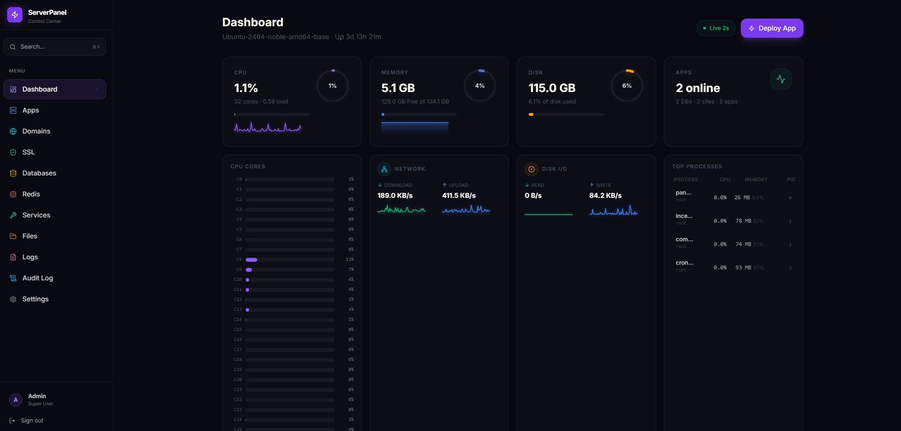
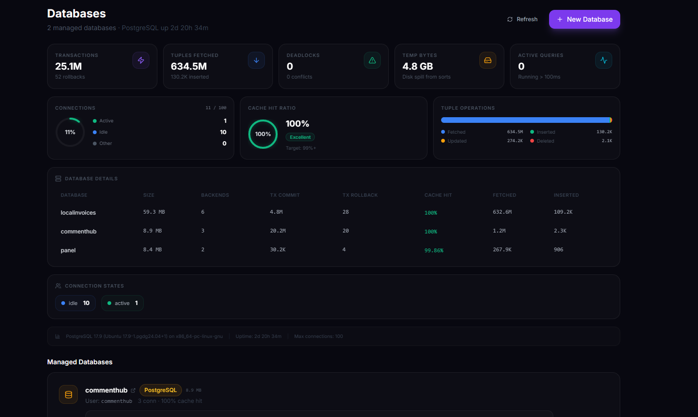
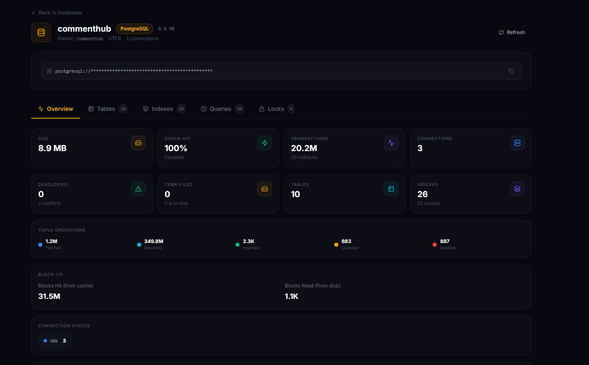

# GoNextjs — Nextjs Control Panel

A lightweight, production-safe server control panel for deploying and managing
web applications on a single Ubuntu 22.04+ server. Built with a Go backend and
a Vite + React frontend for minimal resource usage (~15 MB RAM for the API).

## Screenshots







## Features

| Feature              | Details                                                                                                      |
|----------------------|--------------------------------------------------------------------------------------------------------------|
| Authentication       | JWT-based admin login with bcrypt, HttpOnly cookies, rate limiting (10 req/15 min), IP lockout after 5 fails, constant-time comparison to prevent timing attacks |
| App Management       | Deploy via GitHub URL, Git URL, or manual ZIP upload; build, start/stop/restart/rebuild/delete with PM2; per-app detail page with tabbed UI (overview, logs, config, deployments); auto port allocation (3001-3999) |
| Environment Vars     | Store env vars in DB, sync to `.env` on disk, read `.env` + `.env.local` with source tracking, auto-restart PM2 on change |
| Domain Mgmt          | Auto-generate NGINX reverse-proxy configs with rollback on failure                                           |
| SSL                  | Let's Encrypt via Certbot, auto-renewal, enable/disable SSL per domain                                      |
| Databases            | Create/delete PostgreSQL databases + users, random password generation, connection string display            |
| Database Monitoring  | Real-time PostgreSQL dashboard: version, uptime, connections by state, cache hit ratio, transaction stats, tuple ops, deadlocks, per-database stats, active/slow query list |
| Database Backup      | Streaming `pg_dump` download (no temp files), restore from SQL or custom-format dumps (up to 500 MB), auto-detection of dump format |
| Redis                | Install, status check, connection info display                                                               |
| Redis Monitoring     | Real-time Redis dashboard: version, uptime, ops/sec, memory/fragmentation, hit rate, evicted keys, RDB persistence info, per-database keyspace analysis |
| System Services      | Manage 8 systemd services (NGINX, Redis, PostgreSQL, PM2, SSH, UFW, Fail2Ban, Cron): start/stop/restart, view status, PID, memory usage |
| File Manager         | Browse, edit, upload files in `/var/www/apps` with path traversal protection                                 |
| Logs                 | View PM2 stdout/stderr logs and NGINX access/error logs; direct log file reading, configurable line count, syntax highlighting, auto-scroll with pause/resume |
| System Stats         | Live CPU (aggregate + per-core), memory, disk, network I/O, disk I/O, load average, hostname, uptime, top PM2 processes; sparkline history (60 data points) |
| WebSocket Live Stats | Real-time stats pushed every 2 seconds via WebSocket with HTTP polling fallback, JWT auth, ping/pong keep-alive, smart collection (only when clients connected) |
| Panel Self-Update    | One-click updates with SSE-streamed progress, version check against GitHub remote, commit changelog, concurrent update prevention, update log history |
| Command Palette      | `Ctrl+K` / `Cmd+K` quick navigation to any page                                                             |
| Audit Logging        | All POST/PUT/DELETE requests logged to the database                                                          |

## Stack

- **Backend**: Go (Chi router, pgx, golang-jwt, bcrypt)
- **Frontend**: Vite, React, React Router, Tailwind CSS, Lucide icons
- **Infra**: NGINX (serves static frontend + reverse proxy), PM2, PostgreSQL, Redis, Certbot

## Architecture

```
Browser -> NGINX (port 80)
  |-- /               -> serves /opt/panel/frontend/dist/index.html (SPA)
  |-- /assets/*       -> serves static JS/CSS with 1-year cache
  |-- /api/*          -> proxy to Go binary on 127.0.0.1:4000
  |-- /health         -> proxy to Go binary on 127.0.0.1:4000
  '-- /* (fallback)   -> /index.html (SPA client-side routing)

Go binary (127.0.0.1:4000) — single process, ~15 MB RAM
  |-- /health                  -> health check
  |-- /api/auth/*              -> login, logout, me (no auth middleware)
  '-- /api/* (protected)       -> all other endpoints (auth + audit middleware)
```

No Node.js process is needed for the frontend — NGINX serves the pre-built
static files directly. The Go binary is the only runtime process.

## Quick Start

See [DEPLOYMENT.md](./DEPLOYMENT.md) for the full installation guide.

```bash
git clone https://github.com/freddiehdxd/panel.git /opt/panel
bash /opt/panel/scripts/setup_panel.sh
```

## Project Structure

```
panel/
├── backend/                       Go API server
│   ├── main.go                    Entry point, Chi router, middleware, routes
│   ├── go.mod                     Module dependencies
│   └── internal/
│       ├── config/config.go       Environment variable loading + validation
│       ├── models/models.go       App, Database, AuditEntry, Stats, PgOverview, RedisStats structs
│       ├── middleware/
│       │   ├── auth.go            JWT cookie/header verification, context user
│       │   ├── audit.go           POST/PUT/DELETE audit logging
│       │   └── helpers.go         writeJSON helper
│       ├── handlers/
│       │   ├── helpers.go         JSON response + request helpers
│       │   ├── auth.go            Login (lockout, bcrypt), logout, me
│       │   ├── apps.go            CRUD, deploy, PM2 actions, env vars, ZIP upload
│       │   ├── domains.go         Add/remove domain + NGINX rollback
│       │   ├── ssl.go             Certbot enable/disable + NGINX SSL config
│       │   ├── databases.go       PostgreSQL CRUD, monitoring dashboard, backup/restore
│       │   ├── redis.go           Status, install, monitoring dashboard
│       │   ├── services.go        Systemd service management (start/stop/restart)
│       │   ├── files.go           Browse, read, write, upload
│       │   ├── logs.go            PM2 logs + NGINX tail + direct file read
│       │   ├── stats.go           /proc collector, WebSocket live stats, ring buffer history
│       │   └── update.go          Panel version check + SSE-streamed update apply
│       └── services/
│           ├── db.go              pgx connection pool, schema init
│           ├── executor.go        Allowlisted command runner with timeouts
│           ├── pm2.go             PM2 jlist, action, logs
│           ├── nginx.go           Config builder, write, reload
│           └── port.go            Port allocator (3001-3999)
├── frontend/                      Vite + React SPA
│   ├── index.html                 SPA entry point
│   ├── package.json               Vite + React + React Router + Lucide
│   ├── vite.config.ts             Dev proxy /api -> :4000, build -> dist/
│   ├── tailwind.config.ts
│   └── src/
│       ├── main.tsx               ReactDOM + BrowserRouter
│       ├── App.tsx                Routes + ProtectedRoute (auth context with 5-min cache)
│       ├── index.css              Tailwind + custom styles
│       ├── lib/api.ts             Fetch wrapper with credentials
│       ├── components/
│       │   ├── Shell.tsx          Layout wrapper
│       │   ├── Nav.tsx            Sidebar navigation + Ctrl+K command palette
│       │   ├── Modal.tsx          Reusable modal
│       │   └── StatusBadge.tsx    Status indicator
│       └── pages/
│           ├── Login.tsx          Login form
│           ├── Dashboard.tsx      Ring gauges, sparkline charts, WebSocket live stats
│           ├── Apps.tsx           Deploy modal, env editor, PM2 actions
│           ├── AppDetail.tsx      Per-app detail page (overview, logs, config, deployments)
│           ├── Domains.tsx        Domain management
│           ├── SSL.tsx            Certificate issuance + disable
│           ├── Databases.tsx      PostgreSQL CRUD + monitoring dashboard + backup/restore
│           ├── Redis.tsx          Status, install, monitoring dashboard
│           ├── Services.tsx       System services management (8 services)
│           ├── Files.tsx          File browser + editor
│           ├── Logs.tsx           Log viewer with syntax coloring + auto-scroll
│           ├── Settings.tsx       Panel self-update + system info
│           └── NotFound.tsx       404 page
├── scripts/                       Bash automation
│   ├── setup_panel.sh             One-shot server setup
│   ├── setup_app.sh               Manual app setup (install, build, PM2 start)
│   ├── update_panel.sh            Panel self-update script
│   ├── deploy_next_app.sh         Next.js app deployment
│   ├── install_nginx.sh           NGINX installation
│   ├── install_postgres.sh        PostgreSQL installation
│   ├── install_redis.sh           Redis installation
│   ├── install.sh                 General install script
│   ├── create_ssl.sh              SSL certificate creation
│   ├── deploy.py                  Python deploy helper
│   └── fix_embed.py               Embed fix utility
└── nginx-templates/
    ├── app.conf.example           Template for hosted apps
    └── panel.conf.example         Template for the panel itself
```

## API Endpoints

```
GET    /health                           Health check (uptime)

POST   /api/auth/login                   Login (returns JWT + sets HttpOnly cookie)
POST   /api/auth/logout                  Logout (clears cookie)
GET    /api/auth/me                      Current user info

GET    /api/apps                         List all apps
POST   /api/apps                         Deploy a new app (Git URL, GitHub URL, or empty)
GET    /api/apps/{name}                  Get app details
POST   /api/apps/{name}/action           Start/stop/restart/rebuild/delete/setup an app
PUT    /api/apps/{name}/env              Update environment variables
GET    /api/apps/{name}/env-file         Read .env/.env.local from disk with source tracking
POST   /api/apps/{name}/deploy-zip       Upload .zip project file for manual deployment

POST   /api/domains                      Add domain to an app
DELETE /api/domains/{domain}             Remove a domain

POST   /api/ssl                          Issue SSL certificate via Certbot
POST   /api/ssl/disable                  Disable SSL for a domain (revert to HTTP)

GET    /api/databases                    List PostgreSQL databases
POST   /api/databases                    Create database + user
DELETE /api/databases/{name}             Drop database + user
GET    /api/databases/stats              PostgreSQL monitoring dashboard
GET    /api/databases/{name}/backup      Download pg_dump backup (streaming)
POST   /api/databases/{name}/restore     Restore from SQL or custom-format dump

GET    /api/redis                        Redis status + connection info
POST   /api/redis/install                Install Redis
GET    /api/redis/stats                  Redis monitoring dashboard

GET    /api/services                     List system services status
POST   /api/services/{name}/start        Start a system service
POST   /api/services/{name}/stop         Stop a system service
POST   /api/services/{name}/restart      Restart a system service

GET    /api/files/{app}                  List files in app directory
GET    /api/files/{app}/content          Read file content
PUT    /api/files/{app}/content          Write file content
POST   /api/files/{app}/upload           Upload files

GET    /api/logs/app/{name}              PM2 logs for an app
GET    /api/logs/app/{name}/file         Direct PM2 log file read
GET    /api/logs/nginx                   NGINX access/error logs

GET    /api/stats                        System stats (CPU, memory, disk, network, processes)
GET    /api/stats/ws                     WebSocket live stats stream (2s interval)

GET    /api/update/check                 Check for panel updates (compare with remote)
POST   /api/update/apply                 Apply panel update (SSE-streamed progress)
GET    /api/update/log                   View last update log
```

## Security Model

- No arbitrary shell execution. The backend only runs commands from an explicit
  allowlist via `executor.go`, with argument validation to prevent injection.
- All inputs (app names, domains, PostgreSQL identifiers) are validated with
  strict regexes before being passed to any system command.
- The API backend listens only on `127.0.0.1:4000` — never exposed to the internet.
- JWT tokens expire after 2 hours.
- Login rate limiting: 10 req/15 min. General API: 300 req/60 sec.
- Login lockout: 5 failed attempts = 15-minute IP ban.
- Audit logging: all POST/PUT/DELETE requests are logged to the database.
- File manager enforces path traversal protection — all paths are resolved and
  checked to stay within `/var/www/apps/<appname>`.
- bcrypt password hashing (cost 12).

## Performance

Compared to the previous Express + Next.js stack:

| Metric           | Before (Express + Next.js) | After (Go + Vite static) |
|------------------|---------------------------|--------------------------|
| Backend RAM      | ~80 MB                    | ~15 MB                   |
| Frontend RAM     | ~120 MB (Node.js SSR)     | 0 MB (static files)      |
| Total server RAM | ~700 MB                   | ~300 MB                  |
| Binary size      | node_modules (~300 MB)    | ~13 MB single binary     |
| Cold start       | ~3 seconds                | < 100 ms                 |
